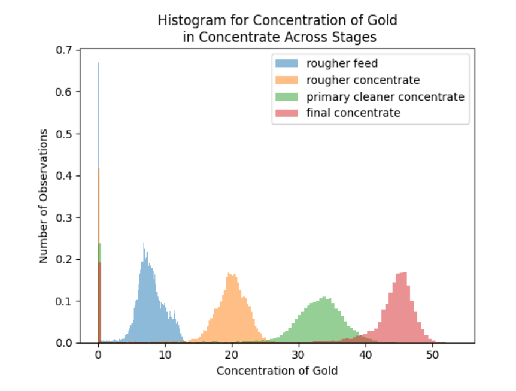
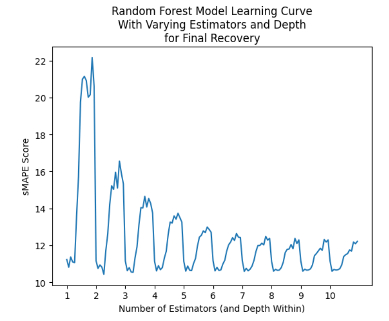

# Sprint 10 Project: Integrated Project 2
 
---

### 📚 Table of Contents
- 🔍 [Project Overview](#project-overview)
- 📈 [Conclusion](#conclusion)
- 🖼️ [Sample Outputs](#sample-outputs)
- 📁 [Files](#files)

---

## Project Overview

Prepare a prototype of a machine learning model for Zyfra. The company develops efficiency solutions for heavy industry.

The model should predict the amount of gold recovered from gold ore. You have the data on extraction and purification.

The model will help to optimize the production and eliminate unprofitable parameters.

You need to:
- Prepare the data;
- Perform data analysis;
- Develop and train a model.

---

## Conclusion

For this project, I modeled the gold ore extraction process to predict the abundance of gold in the final concentrate and rougher residues. I imported and prepared the data, addressed missing and extreme values, verified recovery calculations, observed metal concentration levels at different purification stages, compared feed particle size distributions across datasets, trained regression models, and evaluated them using symmetric mean absolute percentage error (sMAPE).

I verified the rougher concentrate recovery data in the training dataset by recalculating them with a formula. It introduced undefined values due to division by zero in 13.7% of rows, which I dropped for the purposes of verification because I had no basis on which to fill them with other values. The calculated and given values for rougher recovery were effectively identical, confirming the data's validity.

The data were voluminous, occupying up to 87 columns across three datasets with diverse distributions. Some columns were roughly normal but many were skewed, discontinuous, or replete with excess zeros. Data were missing in nearly every column and a substantial minority of rows (35% in the training dataset). The missing values appeared to be randomly distributed and too spread out to be dropped, so I filled them using a forward-filling method.

Rougher feed particle size was similar in training (mean = 60.19, standard deviation = 30.52) and testing (mean = 55.90, standard deviation = 22.71) datasets and final feed particle size was almost identical (training mean = 7.30, standard deviation = 0.62; testing mean = 7.26, standard deviation = 0.61). In both cases, the mean difference between datasets was statistically significant (p < 0.05). I determined that the datasets were similar enough for modeling but standardized all features to be sure.

Examining the concentrations of certain metals (silver, lead, and gold) at various purification stages in the training dataset, it was apparent that the process worked as expected. Gold concentrations steadily and substantially increased (from 7.14 to 39.32) while lead increased much less (3.19 to 9.08) and silver ultimately decreased (7.80 to 4.70).

Exploring the total concentration of all substances at relevant purification stages revealed a large number of very low values, predominantly zeros, representing 9.4% - 11.8% of the data per stage. The observations with excess zeros were mostly the same ones that created divide-by-zero issues during recovery data verification. They appear to be invalid for some reason; data was likely lost or misrecorded. Imputing thousands of excess zeros in dozens of columns seemed impractical without threatening model integrity. I decided the safest solution was to simply drop the problematic observations for modeling, as I had earlier for verification. It was a substantial loss of 15% of the dataset, but not enough to undermine model validity for the remaining 14,287 observations.

The models for this project were ultimately tested on the testing dataset but it lacked all output and calculation features, representing 39% of the training dataset. I dropped the extra features from the training dataset so the models would be amenable to testing. The testing dataset also lacked the targets (rougher.output.recovery and final.output.recovery), so I extracted them from the full dataset by matching observations on the date feature, which served as a unique key across datasets. All models were cross-validated to ensure reliability.

Linear regression models produced an average sMAPE score of 13.96 when predicting rougher recovery and 12.52 when predicting final recovery in the training dataset. The best decision tree regressor models had a maximum depth of 2 when predicting rougher recovery (average sMAPE = 12.53) and final recovery (average sMAPE = 10.69). The best random forest regressor models had 4 estimators and a maximum depth of 6 when predicting rougher recovery (average sMAPE = 11.75) and 2 estimators and a maximum depth of 5 when predicting final recovery (average sMAPE = 10.43). Declining performance with increased complexity suggested that those were likely the best decision tree and random forest regressor models available.

Final evaluation with sMAPE on the test dataset (with targets from the full dataset) revealed remarkable consistency across models. Despite random forest regressor models better predicting both rougher and final recovery during training, they were the worst for both targets during testing. The Final sMAPE score combines rougher and final recovery scores, providing an overall evaluation. Based on Final sMAPE, the decision tree regressor model was slightly better (11.43) than the linear regression model (11.63) and the random forest regressor model (12.15). My final pick was the decision tree regressor model.

---

## Sample Outputs

Here are two key moments from the analysis:

  
*Gold becomes increasingly concentrated at each stage, peaking in the final concentrate. The distribution shifts rightward from feed to final output.*

 

  
*sMAPE score decreases as the number of estimators and tree depth increase. Performance stabilizes after around 6 estimators, with minimal further gain.*

---

## Files

📄 See the full analysis in [`sprint-10-project.ipynb`](./sprint-10-project.ipynb)  
📄 Or view a static version in [`sprint-10-project.html`](./sprint-10-project.html)  
📄 Project background: [`project-description.md`](./project-description.md)

> Note: This project uses three CSV files, all of which are included in the `/data/` folder.  
> See [`/data/README.md`](./data/README.md) for details.
